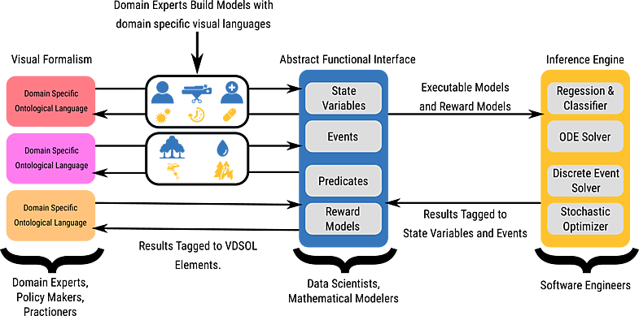
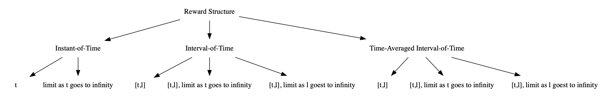

# Report on Initial Architectures, Algorithms, and Learning Approaches

## Introduction

Complex system analysis currently requires teams of domain experts, data scientists, mathematicians, and software engineers to support the entire life cycle of model-based inference.  The models that result are often bespoke, lack generalizability, are not performable, and make it difficult to synthesize actionable knowledge and policies from their raw outputs.  In this proposal we describe AMIDOL: the Agile Metamodel Interface using Domain-specific Ontological Languages, a project that aims to reduce the overhead associated with the model life cycle and enables domain experts and scientists to more easily build, maintain, and reason over models in robust and highly performable ways, and to respond rapidly to emerging crises in an agile and impactful way.  AMIDOL is designed to support models in a number of scientific, physical, social, and hybrid domains by allowing domain experts to construct meta-models in a novel way, using visual domain specific ontological languages (VDSOLs).  These VDSOLs utilize an underlying intermediate abstract representation to give formal meaning to the intuitive process diagrams scientists and domain experts normally create.  AMIDOL's abstract representations are executable, allowing AMIDOL's inference engine to execute prognostic queries on reward models and communicate results to domain experts. AMIDOL binds results to the original ontologies providing more explainability when compared to conventional methods.  We propose initial development of AMIDOL to address problems in the domain of epidemic outbreak and disease management, and to help coordinate policies and responses to these crises in real-time.

AMIDOL addresses the problem of machine-assisted inference with two high-level goals:

1. improving the ability of domain experts to build and maintain models and
2. improving the explainability and agility of the results of machine-inference.

Our techniques for achieving these goals incorporate abstract functional representations, intermediate languages, and semantic knowledge representation and binding in graph structures into traditional machine learning and model solution techniques.

## Content

* [Scientific Domain](#scientific-domain)
* [Architecture](#architecture)
* [Algorithms](#algorithms)
* [Learning Approaches](#learning-approaches)

## Scientific Domain

We will to evaluate AMIDOL using the scientific domain of epidemics management and outbreak response.  The domain is well supported with a rich body of open source models, freely available high quality data for validation, and benchmarking without extensive data cleaning, and is well documented in the literature.  Specifically we propose to focus on modeling the outbreaks and management of the H5N1 strain of influenza [chan2002outbreak], and to cross validate our results with a vaccine effectiveness model of H3N2 influenza treatments [skowronski2014low,flannery2015early,skowronski2017interi].

For H5N1 we will form queries and hypotheses in the form of configurations of the model specified in the \vdsol{}, building representations of various management protocols from the literature [arper2009seasonal].  Using models of the H5N1 outbreak of the early 1990s [kane2014comparison] and its eventual treatment [arino2008model] we will answer questions and run diagnostics of various management plans that were proposed, evaluating outcomes with reward variables derived from formal risk models constructed for these events [dinh2006risk].

For the purposes of cross validation, and to build evidence for the generalizability of AMIDOL we will also study the H3N2 vaccine effectiveness models generated when it was found modern vaccination procedures have been less effective [skowronski2014low,flannery2015early,skowronski2017interi].  While these models are epidemiological, they present different models and data as well as user stories which will help us to prove out \system{}.  We propose to focus on treatment models of H3N2 [nordin2001influenza], including strategies of repeated vaccine application [mclean2014impact], the serial vaccine hypothesis [skowronski2017serial], and the intra-season vaccination model [ferdinands2017intraseason].  We will show comparative analysis of the various strategies and model outcome avoidance and risk by employing a cost-benefit model determined by the CDC [bridges2000effectiveness].

These domain models have relevance to DARPA given both their relevance to real-time planning and incident response, and their application to treating outbreaks and managing the health of individuals deployed overseas, and models of biological weapon impact and countermeasures.  The methods developed for AMIDOL do not assume a specific domain, and the proposed AFI is generalizable and designed to inter-operate with any domain.

## Architecture

In this section we discuss the proposed architecture for AMIDOL, a framework designed to work along side domain experts to automatically generate executable models from Visual Domain Specific Ontological Languages (VDSOLs) using the architecture represented in the following figure.

### VDSOL Architecture

AMIDOL will support the definition of ontological languages which describe systems as formal objects.  Objects for a given domain will be organized into *toolkits* consisting of **nouns** and **verbs**.  Nouns define elements which make up the state space of a system, and verbs define transitions in the state space.  VDSOLs will enable domain experts to build models of complex systems which are easier to maintain, validate, and verify, and avoid common pitfalls of monolithic and hand-coded implementations.

The goal of AMIDOLs VDSOLs is to enable domain experts to define their models using an interface and visual language similar to the semi-formal diagrams they use today, but with the advantage that AMIDOLs VDSOLs have formal, executable, meaning.  VDSOLs will provide a performable, reusable, system for scientists to use when attempting to derive insights relating to the complex systems they represent.

VDSOLs in AMIDOL will be constructed using a graphical user interface implemented using asynchronous javascript and XML to build a responsive interface to define models of complex systems, reward models used to explore and understand complex system behavior, and to interact with the results of solvers implemented in the Machine-Assisted Inference Engine.

Models built using the VDSOL GUI will be saved in XML representations, so they can be exported, shared, and modified easily by members of the scientific community.

### AFI Architecture

In order to support multiple VDSOLs and multiple solvers, AMIDOL will implement an intermediate representation in the form of a state-level Abstract Functional Interface (AFI).  The AFI will give formal meaning to the semi-formal diagrams typically used by domain experts to describe systems, processes, and approaches.  In many scientific, political, and social domains practitioners are in the habit of encoding knowledge through the use of informal algorithmic notations and diagrams.  By using a similar visual language in our VDSOL, we give formal algorithmic meaning by building a formal equivalence relationship between elements of a VDSOL and our AFI.  This intermediate representation in AMIDOL will be backed by implementations of atomic components including:

* State variables
* Actions which alter state variables
* Input predicates which allow for state dependent rates and state dependent enabling conditions for actions.
* Output predicates which define the change to state variables after an action fires.
* Rate reward variables - which implement metrics computed over state variables.
* Impulse reward variables - which implement metrics computed over actions.

The AMIDOL AFI will be defined by two sets of classes, the first of which defines translations to and from a given VDSOL into the intermediate language, and the second which defines translations to and from a solver language, such as C++ objects, or a Stan script for probabalistic programming.  In this way, the AFI funcitons as a stateful compiler which translates the VDSOL representations into execution instructions for the Inference Engine, and also translates the Inference Engine results back into the VDSOL output. We plan to implement the AFI in Scala using the "Quine" system we have developed previously.

### Machine-Assisted Inference Engine Architecture

The AFI will provide an intermediate representation of models in AMIDOL, abstracting away details of potential solver targets, but AMIDOL will also support many solver architectures as back-end targets, allowing models transformed into the AFI to be translated to an appropriate high-level language.  Models can then be solved using a number of techniques, including numerical solution, simulation, or using statistical inference and machine learning.  Initially we propose to support back-end architectures in Stan for probabilistic programming allowing us to specify Bayesian statistical models which can be solved using Markov chain Monte Carlo methods; using numerical solution via state-space generation; and transient and steady-state simulation solvers.  

Our architecture will be designed to easily allow other solvers to be used with AMIDOL, requiring only an appropriate target be supported by the AFI.  We will produce a full documentation of the AFI, with details for implementing new targets easily to support community led solvers, and allowing individuals to attach pre-existing solvers to AMIDOL's framework with minimal effort.

## Algorithms

### Initial Solver Algorithms

Our initial solver for phase 1 will leverage the capabilities of the Stan probabilistic programming language to allow for gradient-based Markov chain Monte Carlo algorithms for Bayesian inference, gradient-based variational Bayesian methods for approximate Bayesian inference, and gradient-based optimization through maximum likelihood estimation.

### Reward Model Algorithms

Measures of interest will be specified using AMIDOL's VDSOL interface by defining reward models over the nouns and verbs used to build a high-level model.  Reward models will be defined using an expression reward variables each of which have a type composed of two components.  The first is the temporal component of the reward structure, illustrated in the following figure:

composed with a type of either impulse or rate reward.  Impulse rewards accumulate reward when an action in the AFI fires.  Rate rewards accumulate reward based on the value of a given state variable.

## Learning Approaches

AMIDOL will aid domain experts in the task of scientific knowledge abstraction through the execution of machine-assisted inference on models defined using VDSOLs.  Results from solvers will be communicated using the AFI to associate outcomes of reward models with the states and actions on which they depend.  The AFI binds these results to objects in the VDSOL to communicate results in a domain-specific and contextually informative way.

AMIDOL will provide benefits for scientists, policy makers, and practitioners by enabling them to construct and modify robust, performable, and executable models of complex systems with minimal effort, and relating raw statistical and numerical outputs to concrete nouns and verbs represented in our visual formalism.  AMIDOL will help highlight causal relationships, comparative analysis, counter-factuals, and aid in planning, risk assessment, and outcome avoidance.  It will achieve these goals by providing an experimental design framework which allows domain experts to interact with the design space of the model, selecting effects and investigating their impact on model response.  AMIDOL will implement regression models to allow users to evaluate the fit of their hypothesis to data, and to use Stan solvers to improve the fit through stochastic optimization and parameter estimation.  Regression significance will be enabled through analysis of variance, and estimation of the posterior distribution.

Users will also be able to introduce acceptance criteria for predictive analysis and conditional forecasting, allowing them to analyze parameterized models to assess the fitness of the processes they represent for crisis management and response.  When forecasting indicates a violation of these criteria, AMIDOL will highlight the bottlenecks to acceptance, indicating sensitivity of the results to actions and state variables in the high level model to help practioners avoid unwanted outcomes by identifying the primary components responsible for failed acceptance.

The results of reward variables and knoweldge extraction will be communicated via explorable graphs and rich UI/UX provided by Bokeh, HoloViews, D3, and similar libraries.

## Bibliography

* Julien Arino et al. “A model for influenza with vaccination and antiviral treat-ment”. In:Journal of theoretical biology253.1 (2008), pp. 118–130.
* Paul KS Chan. “Outbreak of avian influenza A (H5N1) virus infection in HongKong in 1997”. In:Clinical Infectious Diseases34.Supplement2 (2002), S5–S64.
* Pham Ngoc Dinh et al. “Risk factors for human infection with avian influenza AH5N1, Vietnam, 2004”. In:Emerging infectious diseases12.12 (2006), p. 1841.
* Jill M Ferdinands et al. “Intraseason waning of influenza vaccine protection: evi-dence from the US Influenza Vaccine Effectiveness Network, 2011–2012 through2014–2015”.  In:Clinical Infectious Diseases64.5  (2017),  pp.  544–550.
* Brendan Flannery et al. “Early estimates of seasonal influenza vaccine effectiveness-United States, January 2015.” In:MMWR. Morbidity and mortality weekly report64.1 (2015), pp. 10–15
* Michael J Kane et al. “Comparison of ARIMA and Random Forest time seriesmodels for prediction of avian influenza H5N1 outbreaks”. In:BMC bioinformat-ics15.1 (2014), p. 276.
* James Nordin et al. “Influenza vaccine effectiveness in preventing hospitalizationsand deaths in persons 65 years or older in Minnesota, New York, and Oregon:data from 3 health plans”. In:The Journal of infectious diseases184.6 (2001),pp.  665–670.
* uong Q McLean et al. “Impact of repeated vaccination on vaccine effectivenessagainst influenza A (H3N2) and B during 8 seasons”. In:Clinical infectious dis-eases59.10 (2014), pp. 1375–1385.
* Danuta M Skowronski et al. “Low 2012–13 influenza vaccine effectiveness asso-ciated with mutation in the egg-adapted H3N2 vaccine strain not antigenic drift incirculating viruses”. In:PloS one9.3 (2014), e92153.
* Danuta M Skowronski et al. “Serial vaccination and the antigenic distance hy-pothesis: effects on influenza vaccine effectiveness during A (H3N2) epidemics inCanada, 2010–2011 to 2014–2015”. In:The Journal of infectious diseases215.7(2017), pp. 1059–1099