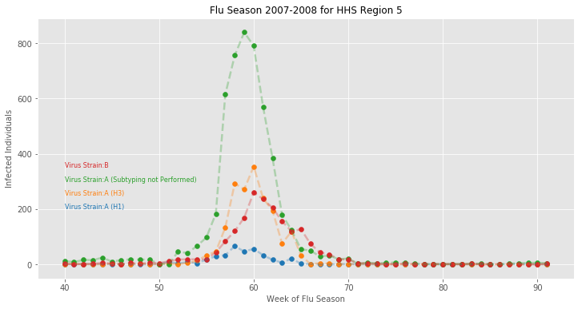

# Documentation for SIRS Model Family

## Model Objectives

**Objective**: Identify the *basic reproduction number* associated with an infection, also known as R0, or *r nought*.  R0 was first used in 1952 when studying malaria and is a measure of the potential for an infection to spread through a population.  If R0 < 1, then the infection will die out in the long run.  If R0 > 1, then the infection will spread.  The higher the value of R0, the more difficult it is to control an epidemic.

Given a 100% effective vaccine, the proportion of the population that needs to be vaccinated is 1 - 1/R0, meaning that R0 can be used to plan disease response.  This assumes a homogenous population, and contains many other simplifying assumptions and does not generalize to more complex numbers.

You can read more about the application of R0 to [H1N1](http://science.sciencemag.org/content/324/5934/1557) and [Ebola](http://currents.plos.org/outbreaks/article/obk-14-0036-early-epidemic-dynamics-of-the-west-african-2014-ebola-outbreak-estimates-derived-with-a-simple-two-parameter-model/).

We have several main goals in this process:

1. Fitting the models for the data in hindsight to perform goodness of fit estimates.
2. Finding the *retrospective* R0 estimate over the entire epidemic curve. [Reference](https://www.researchgate.net/profile/James_Hyman/publication/233988169_chowell_2006_estimation_reproductive_number_spanish_flu_geneva/links/02bfe50dcbe6d4a6b3000000/chowell-2006-estimation-reproductive-number-spanish-flu-geneva.pdf).
3. Finding the *real-time* R0 estimate while the epidemic is ongoing.

## The Data

For these models we will be working with the WHO/NREVSS (World Health Organization/National Respiratory and Enteric Virus Surveillance System) data sets at the resolution of Department of Human and Health Services designated regions.


Using data from a given region, and a given strain, we will estimate R0 for the epidemic curve.



Using the SIRS model, we can build an approximate representation of this system, which we solve with the `odeint` package:

```python
import pandas as pd
from scipy.integrate import odeint
N = int(popData[popData['Year'] == int(popYear)]['HHS 5']) #
I0 = 1
R0 = 0
S0 = N - R0 - I0

gamma = 15
rho = 1.0032
beta = rho*gamma

def deriv(y, t, N, beta, gamma):
    S, I, R = y
    dSdt = -beta * S * I / N
    dIdt = beta * S * I / N - gamma * I
    dRdt = gamma * I
    return dSdt, dIdt, dRdt

y0 = S0, I0, R0

min = 40*7
max = min + len(fluData)*7
t = list(range(min, max))
w = [x/7 for x in t]

ret = odeint(deriv, y0, t, args=(N, beta, gamma))
S, I, R = ret.T
```

Resulting in the following fit:


