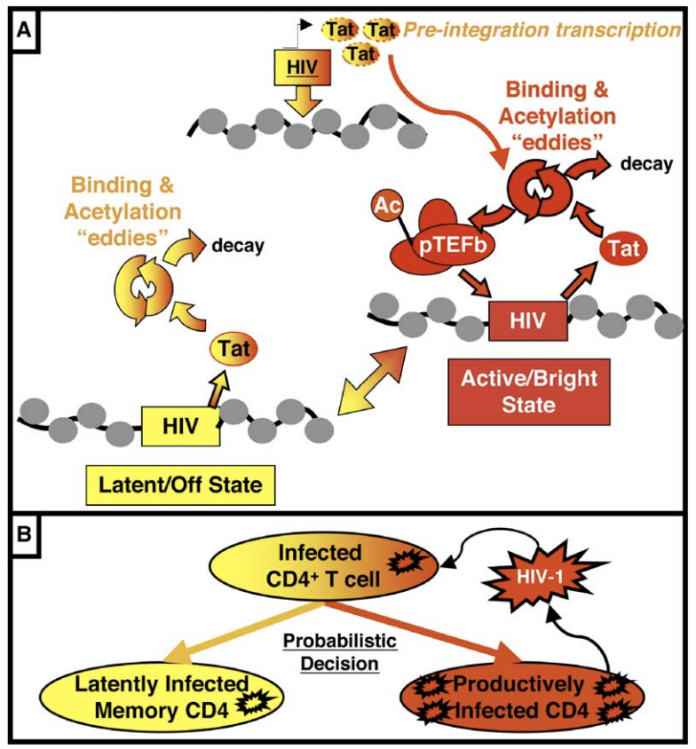

# Documentation for the Tat/HIV Model




## ODE Model
```
  d/dt (tat) = -dtt * tat
  d/dt (nRNA) = (b + v * tat) / (k + tat) - ex * nRNA - dr * nRNA
  d/dt (cRNA) = ex * nRNA - dr * cRNA
  d/dt (P) = vp * cRNA / (kp + cRNA) - dp * P
  RNA = nRNA + cRNA
  dtt = 0.154
  b = 0.01
  dr = 1.6
  ex = 2.6
  dp = 0.39
  v = 150
  k = 50
  vp = 11
  kp = 0.676
```

## Stochastic Chemical Model
```
  LTR -- k_basal --> LTR + nRNA
  nRNA -- k_export --> cRNA
  cRNA -- k1_translate --> GFP + cRNA
  cRNA -- k2_translate --> Tat + cRNA
  Tat <-- k_bind/k_unbind --> pTEFb_d
  LTR + pTEFb_d <-- k_acetyl/k_deacetly --> pTEFb_a
  pTEFb_a -- k_transact --> LTR + nRNA + Tat
  GFP -- d_GFP --> 0
  Tat -- d_Tat --> 0
  cRNA -- d_CYT --> 0
  nRNA -- d_NUC --> 0
```

## Base conditions
```
  DIM
  Tat_0 = 5 +/- 4
  GFP_0 = 75,000 +/- 50,000
  LTR_0 = 1

  MID
  Tat_0 = 25 +/- 10
  GFP_0 = 300,000 +/- 100,000
  LTR_0 = 1

  k_basal = 10^-8 (transcripts/s)
  k_export = 0.00072 (1/s)
  k1_translate = 0.5 (1/s)
  k2_translate = 0.005 (1/s)
  k_bind = 10^-4 (1/(mol * s))
  k_unbind = 10^-2 (1/s)
  k_acetyl = 10^-3 (1/(mol * s))
  k_deacetyl = 0.9 (1/s)
  k_transact = 0.1 (1/s)
```