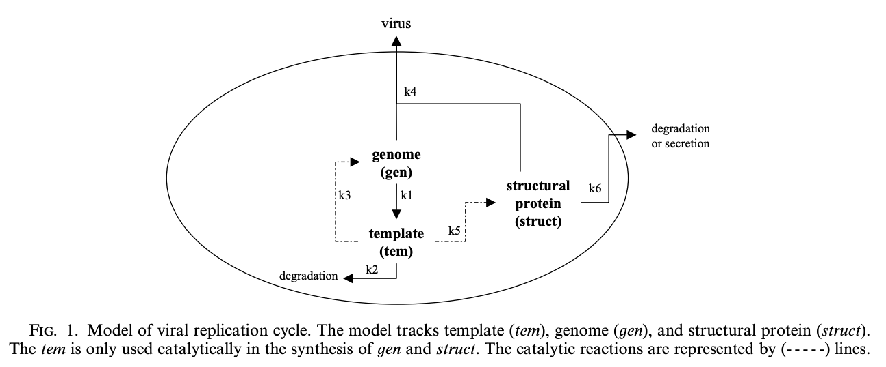

# Viral Replication and Infection Model

(http://www.math.utah.edu/~zapata/Journalclub/srivastava_2002.pdf)

(https://minds.wisconsin.edu/bitstream/handle/1793/10884/file_1.pdf?sequence=1)



## Simple Crystallization Model

```
   2A -- e1 --> B
   A + C -- e2 --> D
```

```
   e1 = 1/2 k1 * A(A-1)
   e2 = k2 * AC
   k1 = 1e-7
   k2 = 1e-7
   A0 = 1e6
   B0 = 0
   C0 = 10
   D0 = 0
```

## Viral Kinetic Model

```
   d[tem]/dt = k1[gen] - k2[tem]
   d[gen]/dt = k3[tem] - k1[gen] - k4[gen][struct]
   d[struct]/dt = k5[tem] - k6[struct] - k4[gen][struct]
```

```
   tem = 20
   gen = 200
   struct = 10,000

   k1 = 0.025 /day
   k2 = 0.25 /day
   k3 = 1 /day
   k4 = 7.5*10^-6 /(mol * day)
   k5 = 1000 /day
   k6 = 1.99 /day
```

## Intracellular viral infection model

(https://minds.wisconsin.edu/bitstream/handle/1793/10884/file_1.pdf?sequence=1)

```
   nucleotides -- e1 --> genome
   nucelotides + genome -- e2 --> template
   nucleotides + amino_acids -- e3 --> struct
   template -- e4 --> degraded
   struct -- e5 --> secreted
   struct -- e5 --> degraded
   genome + struct -- e6 --> secreted virus
```

Assumptions: *nucleotides* and *amino_acids* are available at constant concentrations.  Template catalyzes reactions e1 and e3.  What is the time evolution of the template, genome, and struct species?  Infection is the insertion of one template molecule into a cell.

```
   e1 = 1 /day
   e2 = 0.025 /day
   e3 = 1000 /day
   e4 = 0.25 /day
   e5 = 1.9985 /day
   e6 = 7.5*10^-6 /(molecules * day)

   template = 1
   genome = 0
   struct = 0
```
